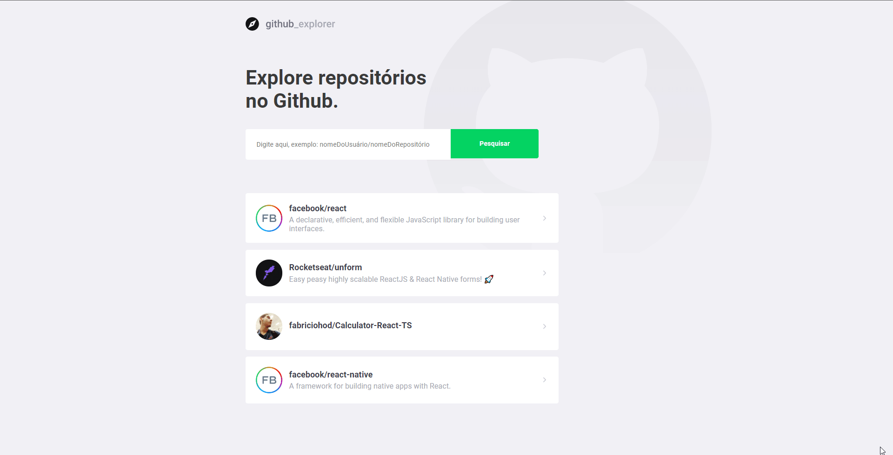

# GitHub Explore


## Descrição

> An application that displays information from repositories using the gitHub api itself, this application was built in one of the bootStamp GoStack modules from [Rockeseat](https://rocketseat.com.br/)

## Instalação

After cloning the repository, enter the server folder to install the application's dependencies using npm

```
npm install
yarn install
```

After installing the dependencies use the command below to run a local server

```
npm run start
yarn start
```


