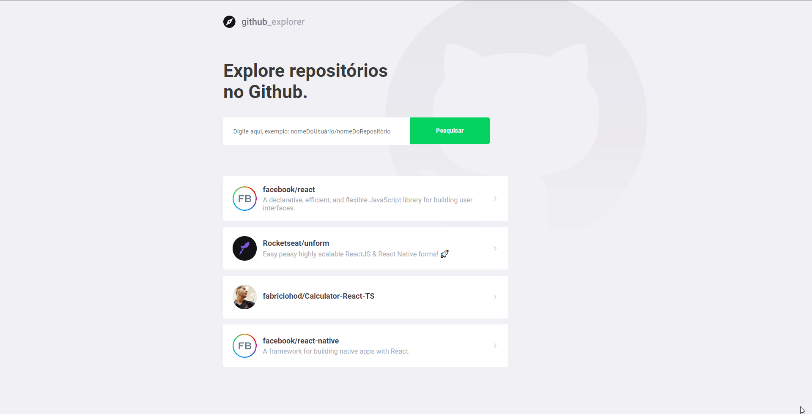

# GitHub Explore


## Descrição

Uma aplicação que mostra informações de repositórios utilizando a api do próprio gitHub, essa aplicação foi construida em um dos módulos do bootCamp GoStack da [Rockeseat](https://rocketseat.com.br/)

>[live Demo](https://git-hub-explore.vercel.app/)

## Instalação

Apos clonar o repositório entre na pasta server para instalar as dependências da aplicação utilizando o npm

```
npm install
yarn install
```

Apos a instalação das dependências use o comando a baixo para rodar um servidor local

```
npm run start
yarn start
```


